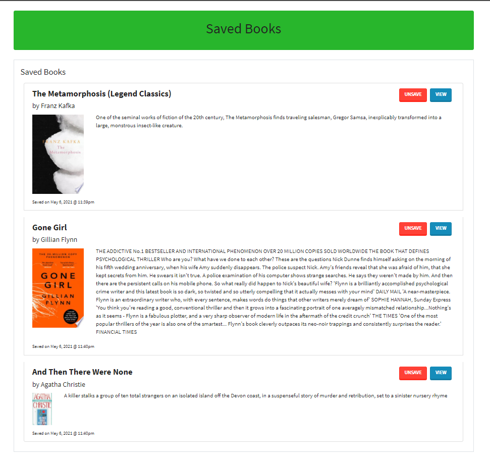
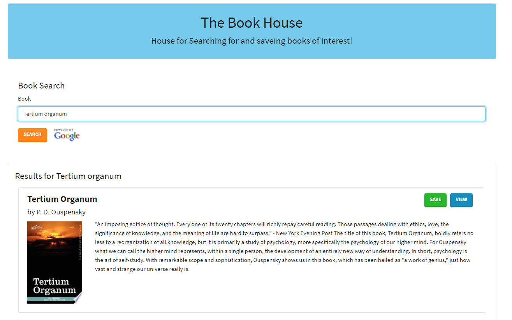

# googlebooks
  React-based Google Books Search app to query and display books based on user searches.
## Description 
Created a book search app utilizing Node.js, Express.js, MongoDB, Heroku and Mongoose. 
 User can search for books via the Google Books API and render them here. 
 User has the option to "View" a book, bringing them to the book on Google Books, or "Save" a book, saving it to the Mongo database.When Saved  to the Mongo database. User has an option to "View" the book, bringing them to the book on Google Books, or "Delete" a book, removing it from the Mongo database.

## Live site: 
https://the-book-house.herokuapp.com/

## Images
Image of main view:

Image of adding exercises:

## Installation 
You will need to npm init to get all the required node modules. If you are running the code locally the local host is set to port 3000. You will also need to go in to the config folder and possibly change the config.json values. The file used to start the project is server.js.

## Credits 
Great gratitude to Luca ([https://github.com/duvet86](https://github.com/duvet86)), Sam ([https://github.com/sam-ngu](https://github.com/sam-ngu)) from the UWA Bootcamp for their enormous help.
## Contributing 
I was the only one to work on this project, but of course I had help from my instructor, TA's, and classmates.

## License
[MIT](https://choosealicense.com/licenses/mit/)
